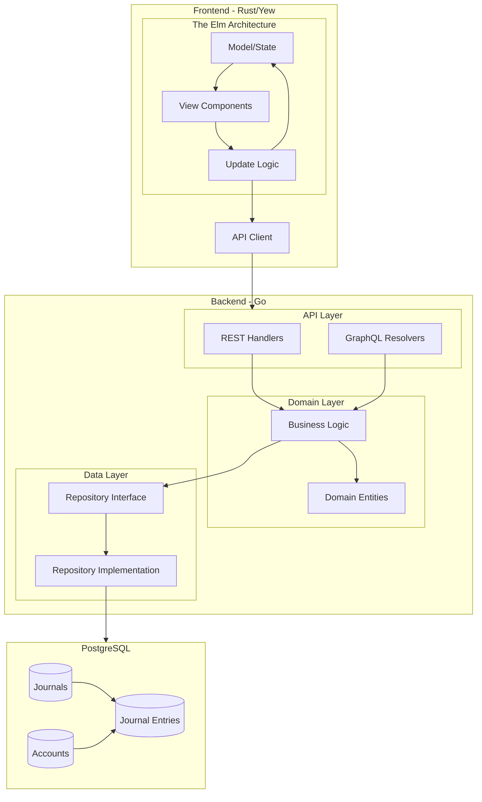
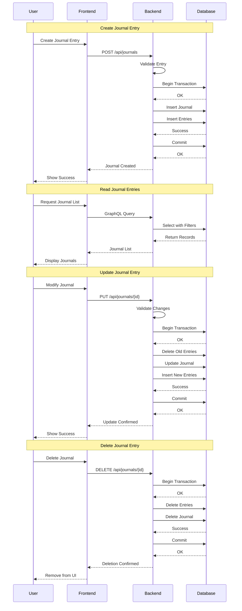

## Requirements

- mise
- docker
- docker-compose

## Architecture

### Frontend
- Built with Rust + Yew framework for WebAssembly
- GraphQL client for data fetching
- Component-based architecture
- Responsive design with CSS Grid

### Backend
- Go with Echo framework
- GraphQL API using gqlgen
- PostgreSQL database with GORM
- RESTful endpoints for basic operations

### Architecture Diagram



### Data Flows



## Development Setup

```shell
❯ mise dup
```


## Tips


```shell
❯ curl -L -X POST \
  http://localhost:8888/api/extract-receipt-ocr-llm \
  -H "Content-Type: multipart/form-data" \
  -F "file=@receipt-analyzer/tests/samples/sample_receipt.png"
{"date":"2024-03-20","amount":1234,"payee":"株式会社ボッタクリサセル様","items":[{"name":"文房具","price":2200},{"name":"コピー用紙","price":1100}]}
```


```shell
curl -X POST http://localhost:8080/api/journals \
  -H "Content-Type: application/json" \
  -d '{
    "date": "2024-03-25T00:00:00Z",
    "description": "備品購入",
    "entries": [
      {
        "account_id": 3,
        "is_debit": true,
        "amount": 10000
      },
      {
        "account_id": 1,
        "is_debit": false,
        "amount": 10000
      }
    ]
  }'
```


```shell
curl -X PUT http://localhost:8080/api/journals/1 \
  -H "Content-Type: application/json" \
  -d '{
    "date": "2024-03-25T00:00:00Z",
    "description": "備品購入（更新）",
    "entries": [
      {
        "account_id": 1,
        "is_debit": true,
        "amount": 15000
      },
      {
        "account_id": 2,
        "is_debit": false,
        "amount": 15000
      }
    ]
  }'
```


```shell
curl -X DELETE http://localhost:8080/api/journals/1
```

```graphql
query ListJournals {
  journals(
    pagination: { page: 1, perPage: 10 }
    filter: {
      dateRange: { from: "2024-01-01T00:00:00Z", to: "2024-12-31T23:59:59Z" }
      # accountCodes: ["1001", "1002"]
      # amountRange: { min: 1000, max: 1000000 }
    }
  ) {
    items {
      id
      journalNumber
      date
      description
      entries {
        id
        account {
          id
          code
          name
          accountType
        }
        isDebit
        amount
      }
      createdAt
      updatedAt
    }
    pageInfo {
      hasNextPage
      hasPrevPage
      totalPages
      currentPage
    }
  }
}
```
