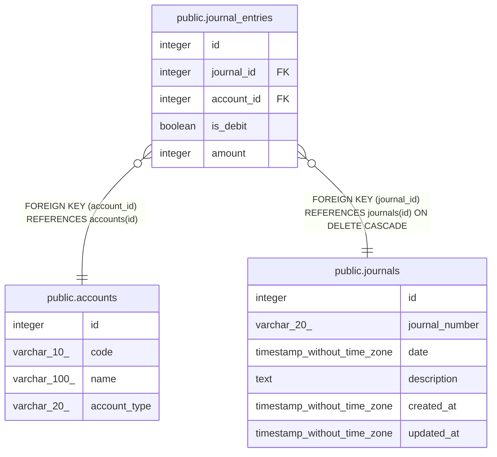

# accounting

## Tables

| Name                                                | Columns | Comment | Type       |
| --------------------------------------------------- | ------- | ------- | ---------- |
| [public.accounts](public.accounts.md)               | 4       |         | BASE TABLE |
| [public.journals](public.journals.md)               | 6       |         | BASE TABLE |
| [public.journal_entries](public.journal_entries.md) | 5       |         | BASE TABLE |

## Relations

---

> Generated by [tbls](https://github.com/k1LoW/tbls)
