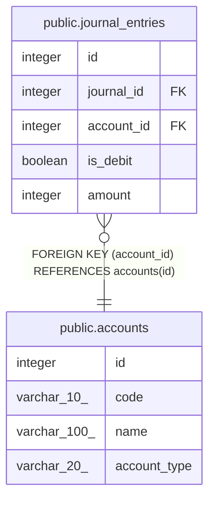

# public.accounts

## Description

## Columns

| Name         | Type         | Default                              | Nullable | Children                                            | Parents | Comment |
| ------------ | ------------ | ------------------------------------ | -------- | --------------------------------------------------- | ------- | ------- |
| id           | integer      | nextval('accounts_id_seq'::regclass) | false    | [public.journal_entries](public.journal_entries.md) |         |         |
| code         | varchar(10)  |                                      | false    |                                                     |         |         |
| name         | varchar(100) |                                      | false    |                                                     |         |         |
| account_type | varchar(20)  |                                      | false    |                                                     |         |         |

## Constraints

| Name              | Type        | Definition       |
| ----------------- | ----------- | ---------------- |
| accounts_pkey     | PRIMARY KEY | PRIMARY KEY (id) |
| accounts_code_key | UNIQUE      | UNIQUE (code)    |

## Indexes

| Name              | Definition                                                                  |
| ----------------- | --------------------------------------------------------------------------- |
| accounts_pkey     | CREATE UNIQUE INDEX accounts_pkey ON public.accounts USING btree (id)       |
| accounts_code_key | CREATE UNIQUE INDEX accounts_code_key ON public.accounts USING btree (code) |

## Relations

---

> Generated by [tbls](https://github.com/k1LoW/tbls)
