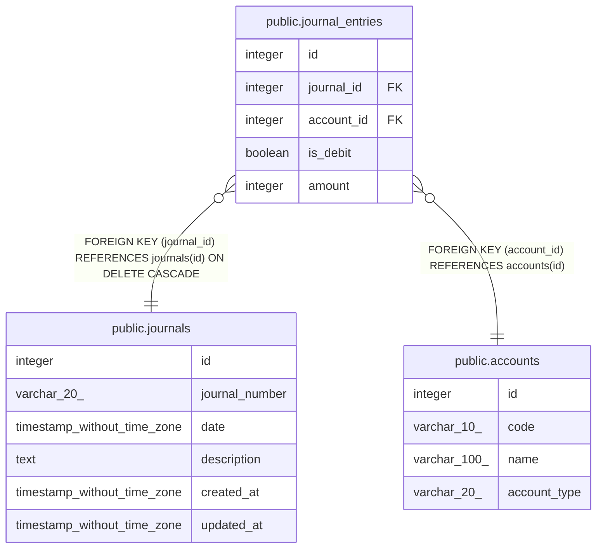

# public.journal_entries

## Description

## Columns

| Name       | Type    | Default                                     | Nullable | Children | Parents                               | Comment |
| ---------- | ------- | ------------------------------------------- | -------- | -------- | ------------------------------------- | ------- |
| id         | integer | nextval('journal_entries_id_seq'::regclass) | false    |          |                                       |         |
| journal_id | integer |                                             | false    |          | [public.journals](public.journals.md) |         |
| account_id | integer |                                             | false    |          | [public.accounts](public.accounts.md) |         |
| is_debit   | boolean |                                             | false    |          |                                       |         |
| amount     | integer |                                             | false    |          |                                       |         |

## Constraints

| Name                            | Type        | Definition                                                         |
| ------------------------------- | ----------- | ------------------------------------------------------------------ |
| journal_entries_account_id_fkey | FOREIGN KEY | FOREIGN KEY (account_id) REFERENCES accounts(id)                   |
| journal_entries_journal_id_fkey | FOREIGN KEY | FOREIGN KEY (journal_id) REFERENCES journals(id) ON DELETE CASCADE |
| journal_entries_pkey            | PRIMARY KEY | PRIMARY KEY (id)                                                   |

## Indexes

| Name                 | Definition                                                                          |
| -------------------- | ----------------------------------------------------------------------------------- |
| journal_entries_pkey | CREATE UNIQUE INDEX journal_entries_pkey ON public.journal_entries USING btree (id) |

## Relations

---

> Generated by [tbls](https://github.com/k1LoW/tbls)
