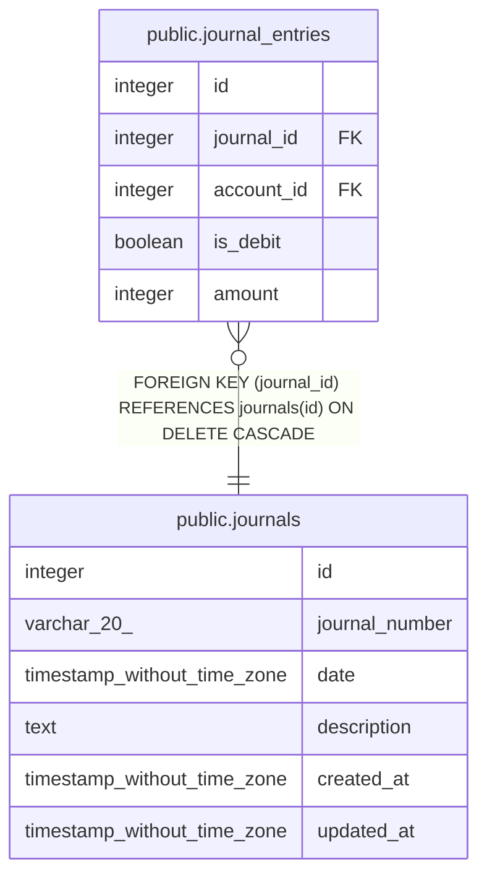

# public.journals

## Description

## Columns

| Name           | Type                        | Default                              | Nullable | Children                                            | Parents | Comment |
| -------------- | --------------------------- | ------------------------------------ | -------- | --------------------------------------------------- | ------- | ------- |
| id             | integer                     | nextval('journals_id_seq'::regclass) | false    | [public.journal_entries](public.journal_entries.md) |         |         |
| journal_number | varchar(20)                 |                                      | false    |                                                     |         |         |
| date           | timestamp without time zone |                                      | false    |                                                     |         |         |
| description    | text                        |                                      | false    |                                                     |         |         |
| created_at     | timestamp without time zone | CURRENT_TIMESTAMP                    | false    |                                                     |         |         |
| updated_at     | timestamp without time zone | CURRENT_TIMESTAMP                    | false    |                                                     |         |         |

## Constraints

| Name                        | Type        | Definition              |
| --------------------------- | ----------- | ----------------------- |
| journals_pkey               | PRIMARY KEY | PRIMARY KEY (id)        |
| journals_journal_number_key | UNIQUE      | UNIQUE (journal_number) |

## Indexes

| Name                        | Definition                                                                                      |
| --------------------------- | ----------------------------------------------------------------------------------------------- |
| journals_pkey               | CREATE UNIQUE INDEX journals_pkey ON public.journals USING btree (id)                           |
| journals_journal_number_key | CREATE UNIQUE INDEX journals_journal_number_key ON public.journals USING btree (journal_number) |

## Relations

---

> Generated by [tbls](https://github.com/k1LoW/tbls)
